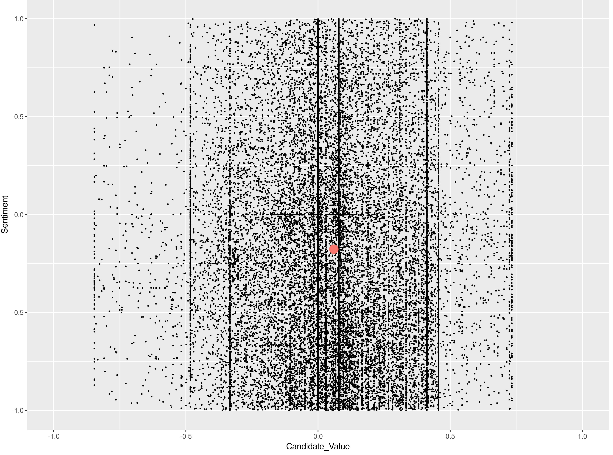
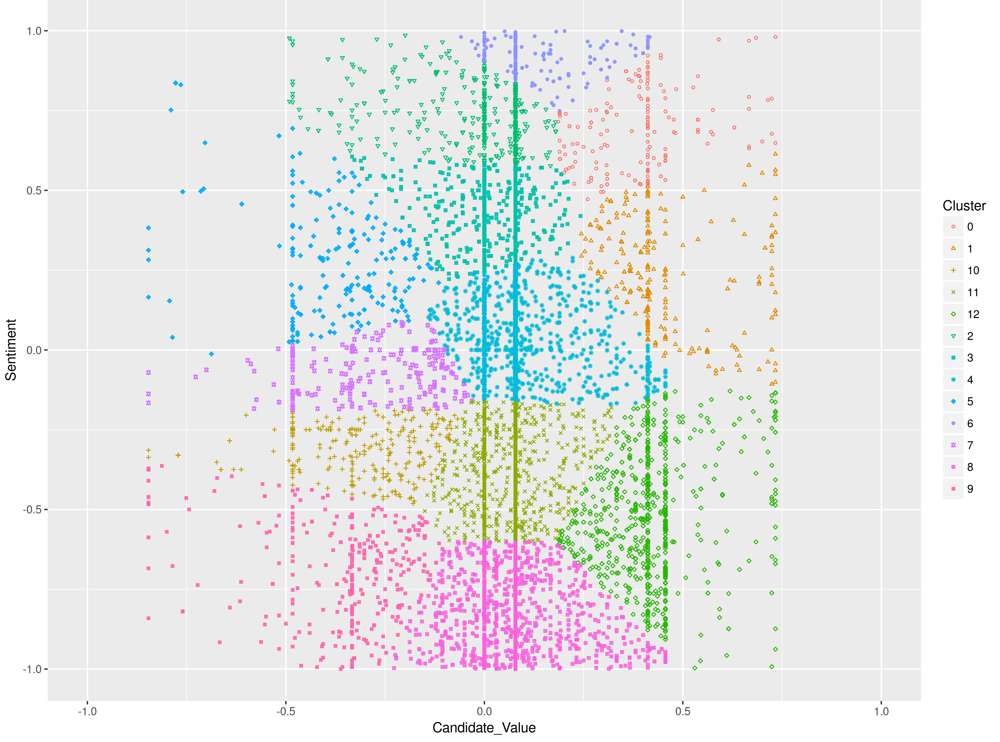

 

	

 

# Twitter Sentiment Clustering Indian Election 2019

## Overview
The goal of this project is to analyze Twitter data related to the 2019 Indian General Election.
We hope to discover classes of tweets by applying clustering techniques on two particular data points: the
sentiment of tweets and how much they reference either the Congress or BJP
candidates. The clusters will then be used to analyze
tweeting behavior over the last few weeks of the election. We hope to see how
specific events during the race influenced Twitter's sentiment towards either candidate.

Data was gathered from 4 weeks prior to the election and the data was pulled from Twitter using Python with the following parameters:

- **Start Date**: 2016-10-16
- **End Date**: 2016-11-14
- **Keywords**: @RahulGandhi OR #RahulGandhi OR Rahul Gandhi OR Rahul OR @narendramodi OR #narendramodi OR Narendra Modi OR Modi

The following values were gathered from each tweet:

- Author-ID
- Date with Time
- Text

SciKitLearn's **Birch Clustering** algorithm was used to cluster the processed data.
The following are graph examples of processed and clustered data:

## Getting Started

#### Requirements:

Requires Python 3.5 and R.

Requires the following Python Packages:

- [GOT3](https://github.com/Jefferson-Henrique/GetOldTweets-python)
- [TextBlob](https://pypi.python.org/pypi/textblob)
- [scikit-learn](https://pypi.python.org/pypi/scikit-learn/0.18.1)

#### Setup and Installation:

To install download or clone repository and install required packages.

The [/src/](src) folder includes all scripts used for this project. The following
are short descriptions of each script:

- [PullTwitterData.py](src/PullTwitterData.py) - Used to pull and write data to CSV
- [ProcessTwitterData.py](src/ProcessTwitterData.py) - Used to process and run sentiment analysis on pulled data
- [ClusterTwitterData.py](src/ClusterTwitterData.py) - Used to run Birch clustering on processed data
- [GraphTwitterData.R](src/GraphTwitterData.R) - Used to export PNG graphs of processed and clustered data

The [/doc/](doc) folder contains an R [Notebook](doc/Notebook.Rmd) used for analyzing
data and results. It also contains [/figures/](doc/figures) folder which includes graphs of all processed and
clustered data.

The [/data/](data) folder contains pre-processed and processed Twitter data while the
final clustered data can be found in the [results](/results/) folder.

Cluster sizes and centroid coordinates can be found in
[results.txt](results/results.txt)

Graph of the total number of Tweets per day can be found in [TweetsPerDay.png](results/TweetsPerDay.png)
